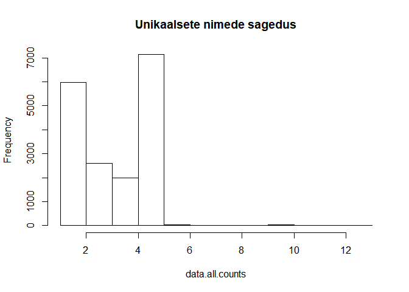
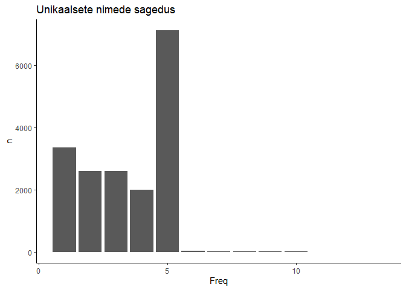

Summary
================
2021-09-25

Unikaalseid täisnimesid 17808.

``` r
data.all.counts = table(data.all$NimiId)
hist(data.all.counts,  main = "Unikaalsete nimede sagedus")
```

<!-- -->

``` r
data.all.counts %>% data.frame() %>% group_by(Freq) %>% summarise(n= n()) %>% ggplot(aes(Freq, n)) + geom_col() + theme_classic() + ggtitle("Unikaalsete nimede sagedus")
```

<!-- -->

Eelnevast on näha, et hist() baasfunktsioon ei näita unikaalsete
täisnimede kasutust õigesti. ggplot graafik on korrektne. Graafiku
põhjal võib järeldada, et suur osa töötajaid on riigitööl olnud 5a ning
kuna 5-st enam on nimede kordusi vähe, siis korduvaid-kattuvaid
täisnimesid pole väga palju.
